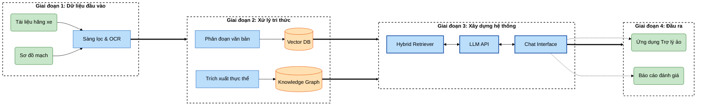

```mermaid
%%{init: {'theme': 'base', 'themeVariables': { 'primaryColor': '#e3f2fd', 'edgeLabelBackground':'#ffffff', 'tertiaryColor': '#fff3e0'}}}%%
graph LR
    %% --- ĐỊNH NGHĨA STYLE (Làm đẹp) ---
    classDef container fill:#ffffff,stroke:#333,stroke-width:2px,stroke-dasharray: 5 5,color:#000,font-weight:bold;
    classDef process fill:#bbdefb,stroke:#1565c0,stroke-width:1px,color:#000;
    classDef storage fill:#ffe0b2,stroke:#e65100,stroke-width:1px,color:#000,shape:cylinder;
    classDef inputOutput fill:#c8e6c9,stroke:#2e7d32,stroke-width:1px,color:#000,shape:rect;

    %% --- BẮT ĐẦU SƠ ĐỒ ---

    %% Giai đoạn 1
    subgraph G1 [Giai đoạn 1: Dữ liệu đầu vào]
        direction TB
        I1(Tài liệu hãng xe):::inputOutput
        I2(Sơ đồ mạch):::inputOutput
        P1[Sàng lọc & OCR]:::process
        I1 --> P1
        I2 --> P1
    end

    %% Mũi tên kết nối G1 sang G2
    P1 ====> G2

    %% Giai đoạn 2
    subgraph G2 [Giai đoạn 2: Xử lý tri thức]
        direction TB
        P2a[Phân đoạn văn bản]:::process
        P2b[Trích xuất thực thể]:::process
        DB1[(Vector DB)]:::storage
        DB2[(Knowledge Graph)]:::storage
        
        P2a --> DB1
        P2b --> DB2
    end

    %% Mũi tên kết nối G2 sang G3
    DB1 ====> G3
    DB2 ====> G3

    %% Giai đoạn 3
    subgraph G3 [Giai đoạn 3: Xây dựng hệ thống]
        direction TB
        SYS1[Hybrid Retriever]:::process
        SYS2[LLM API]:::process
        SYS3[Chat Interface]:::process

        SYS1 <--> SYS2
        SYS2 <--> SYS3
        %% Thêm chú thích cho luồng tương tác
        style SYS1 stroke-width:2px,stroke:#0d47a1
        style SYS2 stroke-width:2px,stroke:#0d47a1
        style SYS3 stroke-width:2px,stroke:#0d47a1
    end

    %% Mũi tên kết nối G3 sang G4
    SYS3 ====> G4

    %% Giai đoạn 4
    subgraph G4 [Giai đoạn 4: Đầu ra]
        direction TB
        O1(Ứng dụng Trợ lý ảo):::inputOutput
        O2(Báo cáo đánh giá):::inputOutput
    end

    %% Kết nối cuối cùng bên trong G4 (để bố cục đẹp hơn)
    SYS3 -.-> O1
    SYS3 -.-> O2

    %% --- ÁP DỤNG STYLE CHO CÁC KHỐI ---
    class G1,G2,G3,G4 container;
```
