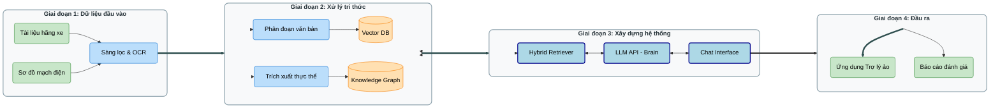

```mermaid
%%{init: {
  'theme': 'base',
  'themeVariables': {
    'primaryColor': '#e1f5fe',
    'secondaryColor': '#fff3e0',
    'tertiaryColor': '#e8f5e9',
    'mainBkg': '#ffffff',
    'nodeBorder': '#455a64',
    'clusterBkg': '#f5f5f5',
    'clusterBorder': '#90a4ae',
    'lineColor': '#546e7a',
    'fontFamily': 'arial, sans-serif'
  }
}%%
graph LR
    %% --- ĐỊNH NGHĨA STYLE ---
    classDef container fill:#f8f9fa,stroke:#90a4ae,stroke-width:2px,rx:10,ry:10,color:#263238,font-weight:bold;
    classDef process fill:#bbdefb,stroke:#1976d2,stroke-width:1px,rx:5,ry:5,color:#000;
    classDef storage fill:#ffe0b2,stroke:#f57c00,stroke-width:1px,color:#000,shape:cylinder;
    classDef inputOutput fill:#c8e6c9,stroke:#388e3c,stroke-width:1px,rx:5,ry:5,color:#000,shape:rect;
    classDef emptybox width:0px,height:0px,fill:none,stroke:none;

    %% --- BẮT ĐẦU SƠ ĐỒ ---

    %% Giai đoạn 1
    subgraph G1 [  Giai đoạn 1: Dữ liệu đầu vào  ]
        direction TB
        I1(Tài liệu hãng xe):::inputOutput
        I2(Sơ đồ mạch điện):::inputOutput
        P1[Sàng lọc & OCR]:::process
        I1 --> P1
        I2 --> P1
    end

    P1 ====> G2

    %% Giai đoạn 2
    subgraph G2 [  Giai đoạn 2: Xử lý tri thức  ]
        direction TB
        startG2[ ]:::emptybox
        P2a[Phân đoạn văn bản]:::process
        P2b[Trích xuất thực thể]:::process
        DB1[(Vector DB)]:::storage
        DB2[(Knowledge Graph)]:::storage
        
        startG2 --> P2a
        startG2 --> P2b
        P2a --> DB1
        P2b --> DB2
        
        joinG2[ ]:::emptybox
        DB1 --> joinG2
        DB2 --> joinG2
    end
    
    linkStyle 3,4,7,8 stroke-width:0px,fill:none;

    joinG2 ====> G3

    %% Giai đoạn 3
    subgraph G3 [  Giai đoạn 3: Xây dựng hệ thống  ]
        direction TB
        startG3[ ]:::emptybox
        SYS1[Hybrid Retriever]:::process
        SYS2[LLM API - Brain]:::process
        SYS3[Chat Interface]:::process

        startG3 --> SYS1
        SYS1 <--> SYS2
        SYS2 <--> SYS3
        
        %% Style sử dụng TÊN MÀU thay vì mã Hex để tránh lỗi
        style SYS1 stroke-width:2px,stroke:darkblue,fill:lightblue
        style SYS2 stroke-width:2px,stroke:darkblue,fill:lightblue
        style SYS3 stroke-width:2px,stroke:darkblue,fill:lightblue
    end
    
    linkStyle 10 stroke-width:0px,fill:none;

    SYS3 ====> G4

    %% Giai đoạn 4
    subgraph G4 [  Giai đoạn 4: Đầu ra  ]
        direction TB
        startG4[ ]:::emptybox
        O1(Ứng dụng Trợ lý ảo):::inputOutput
        O2(Báo cáo đánh giá):::inputOutput
        
        startG4 --> O1
        startG4 --> O2
    end

    %% --- ÁP DỤNG STYLE CHO CÁC KHỐI LỚN ---
    class G1,G2,G3,G4 container;
    
    %% Tinh chỉnh các mũi tên lớn (Dùng tên màu 'darkslategray' thay vì mã hex)
    linkStyle 2,9,14 stroke-width:4px,fill:none,stroke:darkslategray;
```
